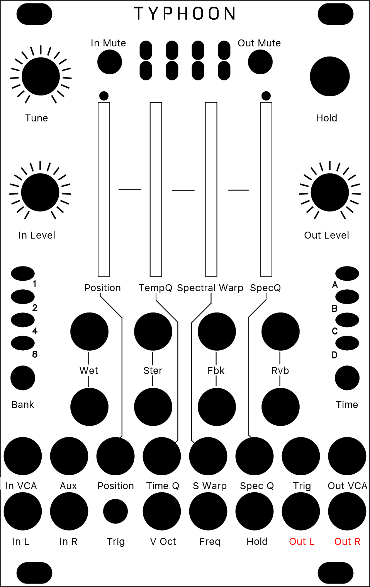
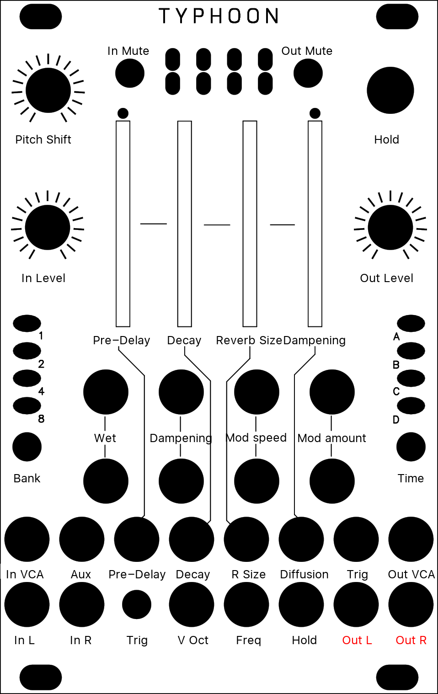
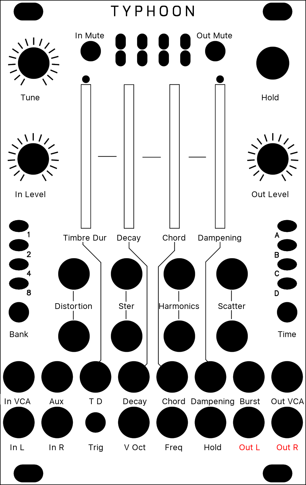
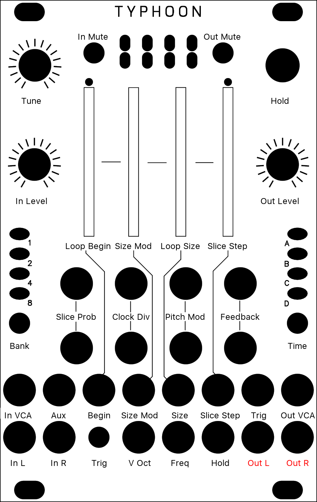
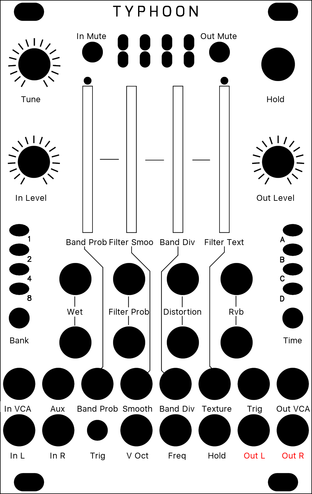

# Typhoon Superparasites Manual

This is a manual/cheatsheet for [Superparasites Firmware](https://github.com/patrickdowling/superparasites) installed on a [Typhoon](https://www.modulargrid.net/e/after-later-audio-typhoon).

PDF version can be found [here](https://raw.githubusercontent.com/capital-G/typhoon-manual/main/README.pdf).

## Granular Processing

[ **\*** O O O ]

The module plays grains continuously, at a rate determined by the DENSITY and SIZE settings. A trigger input is also present, to explicitly instruct the module to start the playback of a new grain. The maximum number of concurrent grains is quite large - between 40 and 60. This specificity brings Clouds closer to the roots of granular synthesis, and allows the synthesis of varied textures even from basic waveforms - there’s indeed many more dimensions to granular synthesis than keeping a playback pointer moving through a SD-card sample!

It is possible, at any time, to FREEZE the audio buffer from which the grains are taken - In this case, the incoming audio is no longer recorded. Somehow, Clouds is the exact opposite of a sampler: by default, the module always samples the audio it receives, except when it is in the frozen state.

{ height=50% }

Original Button | Parameter | Description
--- | --- | --------
Position | Position | Selects from which part of the recording buffer the audio grains are played. Turn the knob clockwise to travel back in time.
Density | Density | At 12 o’clock, no grains are generated. Turn clockwise and grains will be sown randomly, counter-clockwise and they will be played at a constant rate. The further you turn, the higher the overlap between grains.
Size | Size | At 12 o’clock, the buffer is played at its original frequency.
Texture | Texture | Morphs through various shapes of grain envelopes: square (boxcar), triangle, and then Hann window. Past 2 o’clock, activates a diffuser which smears transients.
Wet | Wet | Dry/wet balance
Stereo | Stereo | Stereo spread (amount of random panning/balance applied to the grains).
Feedback | Feedback | Feedback amount.
Reverb | Reverb | Reverberation amount.
Freeze | Freeze | This latching button stops the recording of incoming audio. Granularization is now performed on the last few seconds of audio kept in memory in the module. When the input gate signal is high, stops the recording of incoming audio, just as latching the FREEZE button would do.
Trigger | Trigger | Generates a single grain. By moving the grain DENSITY to 12 o’clock, and sending a trigger to this input, Clouds can be controlled like a micro-sample player. An LFO or clock divider (or even a pressure plate) can thus be used to sow grains at the rate of your choice.
Input Level | In Level | From -18dB to +6dB.

Source: [Clouds Manual](https://mutable-instruments.net/modules/clouds/manual/)

## Pitch Shifter

[ O **\*** O O ]

This mode is quite similar to the granular mode, except that it uses two overlapping grains synchronized with the most salient period of the sound. The grains are carefully spliced so that they mesh well with each other (a technique similar to the “deglitching” of early pitch-shifters).

{ height=50% }

Original Button | Parameter | Description
--- | --- | --------
Position | Pre-Delay | Modulating POSITION when recording is frozen will “scrub” through the audio buffer. Clouds’ uses classic time-domain methods which are not suitable for polyphonic or percussive material (unless this percussive material is breakbeats and you liked Akai samplers. Then: smile).
Density | Diffusion | Creates a granular diffusion effect based on all-pass filters.
Size | Size | Controls the size of the overlapping windows used for pitch-shifting and time-stretching – from an extremely grainy “drilling” sound to smooth bits of loops.
Texture | LP/HP Filter | Acts as a low-pass/high-pass filter.
Trigger | Trigger | Sending a trigger to the TRIG input creates a clock-synchronized loop (when FREEZE is enabled) or stuttering effect – equivalent to applying a tempo-synchronized decaying envelope on the POSITION parameter.

Source: [Clouds Alternate Modes Manual](https://mutable-instruments.net/modules/clouds/alternate_modes/)

## Looping Delay

[ O O **\*** O ]

The looping delay mode continuously plays back audio from the buffer without any kind of granularization.

{ height=50% }

Original Button | Parameter | Description
--- | --- | --------
Position | Pre-Delay | Controls the distance between the playback head and the recording head (in other words, the delay time). Modulating POSITION will create effects similar to vinyl scratching or manual manipulation of tape.
Density | Diffusion | Creates a granular diffusion effect based on all-pass filters.
Size | Size | Controls the size of the overlapping windows used for pitch-shifting and time-stretching – from an extremely grainy “drilling” sound to smooth bits of loops.
Texture | LP/HP Filter | Acts as a low-pass/high-pass filter.
Hold | Hold | When FREEZE is activated, the content of the audio buffer is looped (stutter effect). POSITION controls the loop start and SIZE the loop duration. DENSITY creates a granular diffusion effect based on all-pass filters; and TEXTURE acts as a low-pass/high-pass filter.

Source: [Clouds Alternate Modes Manual](https://mutable-instruments.net/modules/clouds/alternate_modes/)

## Spectral Madness

[ O O O **\*** ]

In this mode, the incoming signal is converted into “frames” of spectral data, that are stored, transformed, recombined, and resynthesized as a time-domain signal.

{ height=50% }

Original Button | Parameter | Description
--- | --- | --------
Position | Position | POSITION selects into which buffer the audio is poured (when FREEZE is not active), or from which buffer the audio is synthesised (when FREEZE is active). For example, set POSITION to its minimum value. Press FREEZE. You get a first texture. Set POSITION to its maximum value. UNFREEZE. Wait for something else to happen in the incoming audio. Press FREEZE again. By moving POSITION you interpolate between the two textures which had been captured at the press of FREEZE. Depending on the quality settings there are 2 to 7 buffers laid out over the course of the POSITION knob. What the module does is crossfade between a “wavetable” of FFT slices.
Density | Tempo Quantisation | Determines how results from the analyzer are passed to the resynthesizer. Below 12 o’clock, there’s some increasing probability that a given FFT bin won’t get updated, causing a kind of partial freeze. After 12 o’clock, adjacent analysis frames are increasingly merged together (like a low-pass filter in the amplitude each frequency bin). At extreme settings, random phase modulation is applied to smooth things - giving you different flavours of spectral muddling/reverb.
Size | Spectral Warp | Changes the coefficients of a polynomial that determines how frequencies are mapped between the analysis and synthesis buffers. It’s like a 1-knob GRM Warp. Over the course of the knob it’ll do spectral shifting, but also spectral reversal.
Texture | Spectral Quantisation | Does two things: below 12 o’clock, it increasingly quantizes the amplitudes of the spectral components, like a very low-bitrate audio file. After 12 o’clock, it increasingly weakens the strongest partials and amplifies the weakest ones. This has the effect of making the spectrum more noise-like.
Trigger | Trigger | Sending a trigger to the TRIG input creates various frequency-domain glitches typical of corrupted (encoded) audio files. It works as a kind of build-up/feedback effect - the shorter the pulse, the smaller the effect. With a continuous gate, it’ll really start to rot…

Source: [Clouds Alternate Modes Manual](https://mutable-instruments.net/modules/clouds/alternate_modes/)

## Oliverb

[ O **\*** **\*** **\*** ]

A new, full-featured creative reverb mode based on the reverb of the original firmware (itself based on a description of the Lexicon 480L), and inspired in design by the Erbe Verb, with CV control over all parameters. It is largely modeless, probably unrealistic and goes far beyond your traditional reverb

{ height=50% }

Original Button | Parameter | Description
--- | --- | --------
Position | Pre-Delay | The Position knob controls the time it take for the reverb to kick in after a sound has gone in (from 0 to about half a second). When a clock is fed to the Trig input, this knob becomes a clock divider/multiplier for the pre-delay: at 12 o'clock, the pre-delay takes the value of the clock length; clockwise, this clock is divided, and counter-clockwise it is multiplied following the rates: 1/16, 3/32, 1/8, 3/16, 1/4, 3/8, 1/2, 3/4, 1, 3/2, 2/1, 3/1, 4/1, 6/1, 8/1, 12/1 (borrowed from the Echophon). Note that the clock division is limited to the largest division not exceeding the maximum delay; beyond this point, the Position knob will have no effect. Changing pre-delay in real time is smooth and does not affect pitch (it uses the internal time stretcher).
Density | Decay | The Density knob controls the amount of sound fed back into the reverb loop, i.e. the decay time of the reverb tail. Beyond 3 o'clock, this signal is actually amplified and the reverb enters self-oscillation.
Size | Reverb Size | The Size knob controls the lengths of all the delays internal to the reverb, i.e. the size of the emulated room. It varies from a small resonator to a huge hall.
Texture | Dampening | The Texture knob controls the dampening of the reverb. From fully CCW to 12 o'clock, a low-pass filter is applied, simultaing the absorption of the room. From 12 o'clock to fully CW, a high-pass filter is applied for unusual, crystalline effects.
Wet | Wet | The first function of the Blend knob is dry/wet crossfading, as in the other modes.
Stereo | Diffusion | The second Blend mode (called "stereo spread") controls how much the sound is "smoothened" by the diffusers each time it goes through the loop. Fully clockwise, you get the more dense, continuous sound; fully counter-clockwise, you clearly hear the sound being repeated like in a multi-tap delay.
Feedback | Modulation speed | The third function of the Blend knob (called "feedback") controls the speed of these LFOs. It ranges from ~1/100Hz to ~100Hz. It has no effect if modulation amount is null.
Reverb | Modulation amount | Each delay in the reverb can be individually modulated by 9 smoothed random LFOs. The fourth function of the Blend knob (called "reverb") controls the amount of modulation applied by the LFOs to the delay time. Small modulations result in subtle chorus and ghost tones, large modulations in random pitch shifts.
Tune | Pitch Shift | Each time the sound is fed back into the reverb, it can be pitch shifted. The Pitch knob controls, from -1 to +1 octaves how it is pitch shifted. At 12 o'clock, no pitch shifting is applied; fully clockwise, we get the classic shimmer effect; lots of oddities can be found in between. To hear the effect of the pitch shifter, some sound has to fed back by increasing Decay. Note that Size has an impact on how well the sound is pitch-shifted: the larger the room size, the more accurate the pitch shift.
Freeze | Freeze | The Freeze button sets reverb to (near) infinite decay, and mutes the input. This works best with no pitch shifting and a large size.

Source: [mqtthiqs Parasites](https://mqtthiqs.github.io/parasites/clouds.html)

## Resonator

[ **\*** O **\*** **\*** ]

It is a dual-voice, four-parts resonator (or comb filter) effect with built-in capability for polyphonic Karplus-Strong plucked string synthesis, and more. You access it by long-pressing the Blend button until LEDs become orange, and press it again several times until only the second LED is unlit (in other words, if LEDs 1, 3 and 4 are lit).

{ height=50% }

Original Button | Parameter | Description
--- | --- | --------
Position | Timbre Duration | Controls the timbre and duration of the noise burst. CCW, it will be longer and more dampened; CW, it will be shorter and more high pitched. At both ends of the knob, the burst will be inaudible (too damped or too short), which you can use to "mute" a voice.
Density | Decay | Decay time of the current voice. Beyond approx. 3 o'clock, decay is infinite and the sound sustains forever (you can use it as a traditional oscillator).
Size | Chord | Chord selection for the current voice. Morphs gradually between Unison, Fat, Superfat, Fat power, Fat octave, Octaves, Power, Major, Major7, Minor7, Minor, Sus2, Sus4, Minor9, Major9, Minor11, Major11, and Major11.
Texture | Dampening | Controls filtering in the feedback loop of the resonator. At 12 o'clock, no filtering is applied; CCW, a low-pass filter is applied with a increasingly low cutoff frequency; CW, a band-pass filter at the frequency of the resonator is applied with an increasingly high resonance.
Wet | Distortion | Randomly distorts the timbre of the voices by modulating each comb filter by low pass-filtered noise. Fully CCW, the modulation amount is maximum but the noise is filtered out entirely, so there is no effect. Fully CW, the noise is unfiltered, but the modulation amount is null, so there is no effect. In between, you get interesting effects, from subtle swaying to harsh distortion.
Stereo | Stereo | Assigns each part and voice to an output (Out L or Out R). Fully CCW, each voice goes to a different output. At 12 o'clock, both voices are equally mixed in both output. Fully CW, parts of both voices are distributed on both output for a wide stereo effect.
Feedback | Harmonics | Simulates striking the harmonics on a string. Fully CCW, it has no effect. Fully CW, the second harmonic will ring; at 12 o'clock, the third, at 10 the fourth etc.
Reverb | Scatter | Controls the random delay times before the sound (input or burst) hits each resonator of the current voice. Used for K-S synthesis with a chord, this will give the impression that strings are struck sloppily. The delay times are randomized at each voice switch.
Trigger | Burst | A trigger in this input will switch the current voice (if Freeze is not active) and send a short burst of noise in its resonator.
Hold | Hold | Switch the current voice, and inhibits further voice switch by the Trig CV.
Tune | Pitch | Base pitch of the current voice. At 12 o'clock, the pitch is A3 (220Hz).

Source: [mqtthiqs Parasites](https://mqtthiqs.github.io/parasites/clouds.html)

## Kammerl Beat Repeat

[ **\*** **\*** O **\*** ]

*Note: This mode requires a clock signal plugged into the Trigger input. Without a clock signal, it holds the most recent slice (or outputs silence if no clock signal has been previously provided).*

The Kammerl Beat-Repeat mode analyzes the incoming clock signal to enable real-time slicing of the audio input. It manages multiple slices in real-time which can be individually selected. Each slice can be played back with different loop, pitch and distortion settings.

{ height=50% }

Original Button | Parameter | Description
--- | --- | --------
Position | Loop Begin | Defines the beginning of the loop interval relative to the total slice duration. To support in-sync beat repetitions, it is quantized as follows: [0-1/64] free/unquantized, 1/64, 1/32, 1/16, 1/8, 1/4, 1/3, 1/2, 1.
Density | Loop Size Modulation | Enables a decreasing loop size towards the slice end. This enables a ping-pong bouncing ball effect: Tak tak tak taktak tatatatatttttttt
Size | Loop Size | Defines the size of the loop interval relative to the total slice duration as well as the loop mode (regular/alternating). To support in-sync beat repetitions, it is quantized as follows: **Regular** from the left to 12 o'clock: [0-1/64] free/unquantized, 1/64, 1/32, 1/16, 1/8, 1/4, 1/3, 1/2, **Alternating** from 12 o'clock to the right: 1/2, 1/3, 1/4, 1/8, 1/16, 1/32, 1/64, [1/64-0] free/unquantized
Texture | Slice Step | The Texture CV and the Slice Step control different slice selection parameters. The Texture CV directly selects one of the most recently recorded slices. In contrast, the Slice Step parameter selects individual iteration patterns to jump between slices during playback (which also incorporates the Texture CV slice selection by using it as an offset) Disabled - Only Texture CV selects slices - Slice step 1 - Repeats current slice due to synced playback index - Slice step 2 - Skips every second slice - Slice step 3 - Skips two slices - Slice step 5 - Skips four slices - Slice step 6 - Skips five slices - Slice step 7 - Skips six slices - Random - Randomly selects slices. CV: Selects one of the eight most recently recorded slices. 0V corresponds to the most recent slice (real-time / no delay!). Note that slices are continously created from audio input, independent from FREEZE or slice probability mode.
Wet | Slice Probabillity | Defines the probability of disabling bypass and processing an incoming slice. Note that activating the FREEZE button overwrites this setting.
Stereo | Clock Divider | Selects a clock divider: 1, 1/2, 1/4, 1/8 which changes the slice lengths accordingly.
Feedback | Pitch Mode | Selects one of four pitch modulation modes (from left to right): (left position) Fixed pitch - no modulation. Fixed pitch - reverse playback. Linearly decreasing pitch starting from the original pitch to the selected target pitch (Pitch Knob). Linearly increasing pitch starting from the the selected target pitch (Pitch Knob) to the original pitch. (right position) Simulated vinyl scratching - sinusoidal pitch modulation. The Pitch Knob defines the intensity.
Reverb | Feedback | Controls the contribution to Cloud's feedback path. Combined with lower pitch playback, this leads to *amazing* lazer gun effects on drums :)
Tune | Pitch | Defines the playback speed. The Kammerl Beat-Repeat mode does not time-correct the pitch changes (like a tape or record running at different speeds). This allows for interesting groove effects, since audio is delayed towards the end of the slice but reset at the slice beginning. To the very left, the knob defines a zero pitch, to the very right, the original playback speed. The pitch modulation is determined by the Pitch Mode knob.
Freeze | Freeze | Enables slice processing / beat-repeating. If not enabled, slice processing is randomly enabled based on the blend mode Slice Probability.

Source: [Kammerl Clouds](https://www.kammerl.de/audio/clouds/)

## Spectral Clouds

[ **\*** **\*** **\*** O ]

The Spectral Clouds mode creates cloud-like frequency spectras. It is a high-resolution multiband filter with randomly modulated frequency bands. The logarithmic divisions of the frequency spectrum result in a continuously morphing but musical sounding filter. This mode is inspired by this FFT Randomizer project.

{ height=50% }

Original Button | Parameter | Description
--- | --- | --------
Position | Frequency band probability | Defines the probability of a frequency band to become enabled. To the left all frequency bands are disabled. Check out the sweet spot where only a few frequency bands are active.
Density | Filter Smoothing | Defines the smoothing intensity on the frequency band division as well as the filter band attenuation changes during "trigger input" events. To the left, filter changes are applied immediately; to the right, the current filter configurations is hold.
Size | Frequency band division | Controls the number of filter bands and their corresponding frequency width. To the left, the frequency spectrum is split into 4 filter bands and to the right into 128 filter bands. All frequency band divisions are applied in logarithmic scale to sound musical.
Texture | Filter texture | Defines the smoothing intensity on the frequency band division as well as the filter band attenuation changes during "trigger input" events. To the left, filter changes are applied immediately; to the right, the current filter configurations is hold.
Wet | Wet | Balance between input signal and Spectral Clouds output. Note that the warm distortion effect as well as Cloud's reverb is applied post dry / wet.
Stereo | Probability of random filter changes | Defines the chance of simulated "Trigger input" events. To the left, simulated trigger events are disabled and random filter reconfigurations only happen during high trigger input gates.
Feedback | Warm distortion | It's back :) Adds a warm sounding distortion effect (applied post dry/wet).
Reverb | Reverb | Controls the contribution to Cloud's reverb (applied post dry/wet).
Tune | Pitch | Pitch shifting applied to the Spectral Clouds output.
Trigger | Trigger | Randomizes the set of active frequency bands and defines their random attenuation intensity. Note that these trigger events can also be simulated with the second blend mode ("Probability of random filter changes").

Source: [Kammerl Clouds](https://www.kammerl.de/audio/clouds/)

## License

cc-by-sa 3.0

* Mutable Instruments Manual: cc-by-sa 3.0
* Kammerl: [MIT License](https://www.kammerl.de/audio/clouds/NOTICE.txt)
* Parasites: [MIT LIcense](https://mqtthiqs.github.io/parasites/)
* Superparasites: [MIT License](https://github.com/patrickdowling/superparasites#license)

## Changelog

### 1.0

* Init release
